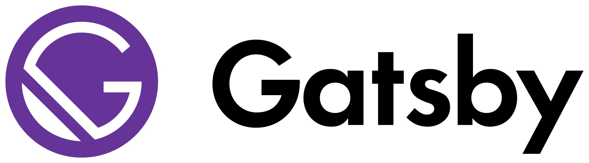

I just launched a new blog with Gatsby.js and Netlify!

In a series of blogposts, I will share my experience in starting a blog with Gatsby and deploying it on Netlify.

## Outline

1. [Why Gatsby?](/blog/gatsby411)
    * Static vs Dynamic Websites
    * Alternatives to Gatsby
    * My Decision in Going with Gatsby
2. More About Gatsby
    * Node.js
    * React
    * GraphQL
        - IDE: GraphiQL and Playground
    * Headless CMS vs CMS
    * Markdown
    * Deployment
3. Resources to Get Started
    * Gatsby Documentation
    * GraphQL Documentation
    * Markdown Documentation
    * Gatsby Boot Camp
4. How to Get Started
    * Download Starters
    * Creating Pages and Linking Them
    * Shared Components
    * Plugins
    * Node API
    * GraphQL: Dynamically Pull Blogposts and Tags
    * Deployment